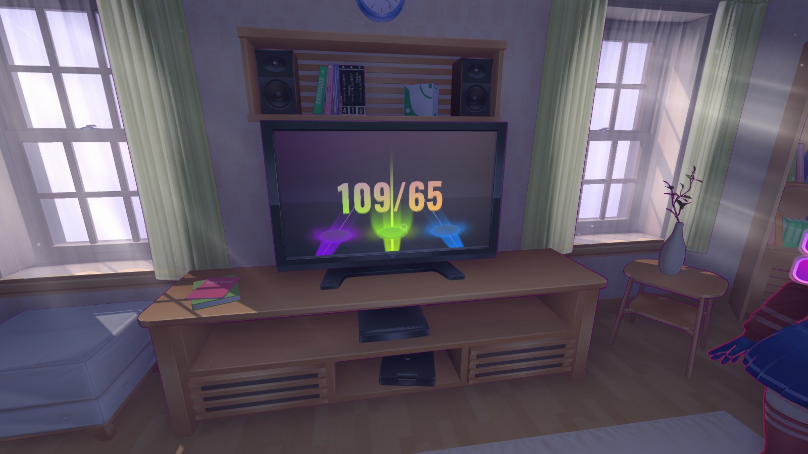

# MiSide game auto click Rythm-game

### About this project

This is a auto clicker for a Rythm game minigame in MiSide game. It takes screenshot every 0.1s and checks the color to determind when to press A, S or D key.

### Note

This project is written in Window 11 on a 1600x900 laptop screen. So if your screen resolution is difference, you must change the coordinates in the variable `SAMPLE_POSITION` in order to make it works.

The positions are in the middle of each circles (all the red dots).

It can be missed if the rhythm is too fast.

This script was tested to work in game build ID 16702566, December 20th, 2024.

### How to use

**Step 1:** Open the MiSide game and start the Rythm game

**Step 2:** Run the script by pressing `F5` in VSCode or run `python main.py`

**Step 3:** In the MiSide game, wait until your turn and press `F2` to start capture screenshots

**Step 4:** When the game finished, press `F2` again to turn off capture.

### Screenshots

### Related

**MiSide game:** https://store.steampowered.com/app/2527500/MiSide/
